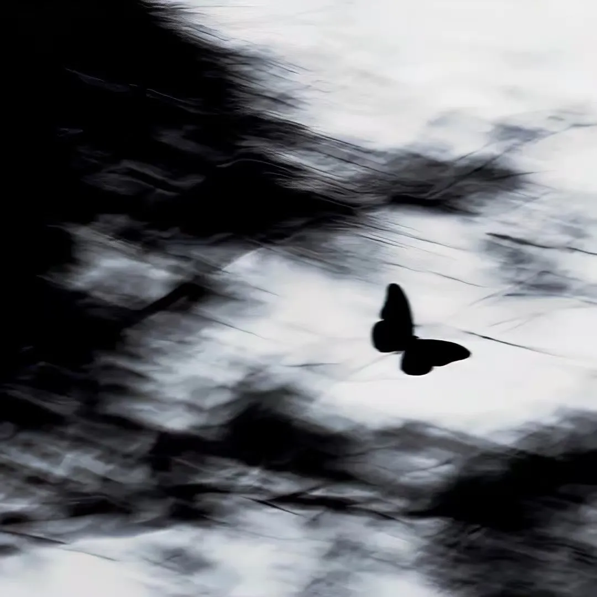

+++
title = "非典型写作分享会"
date = 2025-10-22
draft = false
summary = "解构现实之下的抽象表达，写作与创作分享交流。"
location = "汇丰大楼321教室"
featured_image = "img/640.webp"
tags = ["分享会", "写作", "社团活动"]
+++

**分享会**

北京大学经济学会

解构现实之下的抽象表达——非典型写作分享会

分享人(笔名）：嘉陵江、Rosetta、一乔  

写作并没有想象中那么困难：突然涌现的灵感，心中难发的积郁，抑或是生活中的鸡毛蒜皮，都可以通过文字进行记录。

在等待灵感来敲门的这几年中，断断续续也写了些字，累计至今已创作二十万字有余，包括但不限于小说、散文、杂文、时兴事件衍生。深知还有诸多同好苦于自己写的文章无人分享，抑或是打算创作却无从下手。为此特意举办了该次分享会。

一来是希望能和各位爱好写作的同好交流。二来也是希望能为各位喜欢阅读、意图创作但却因种种原因迟迟未曾动笔的朋友提供一定的帮助。

本次分享会主要由各位喜欢创作的同学进行分享。对于已有创作经历的同学，欢迎大家分享自己创作的内容、灵感来源、创作历程、文中暗藏的心思等。而对于喜欢阅读的同学，也欢迎大家来分享自己喜欢的文章/片段。如果对喜欢的文章/片段有感触或解读，也欢迎展开分享。

本次分享的文体不限——散文，诗歌，小说，同人衍生，乃至当下的抽象表达都欢迎大家进行分享。目前该次分享会已邀请了三位具有创作经历的同学来展开分享。分享文章的题材、内容、文风跨度都很大。欢迎各位感兴趣的同学加入分享或旁听。

2025年10月22日19:00，汇丰大楼321教室，经济学会欢迎您来！

**END**

关注我们！

